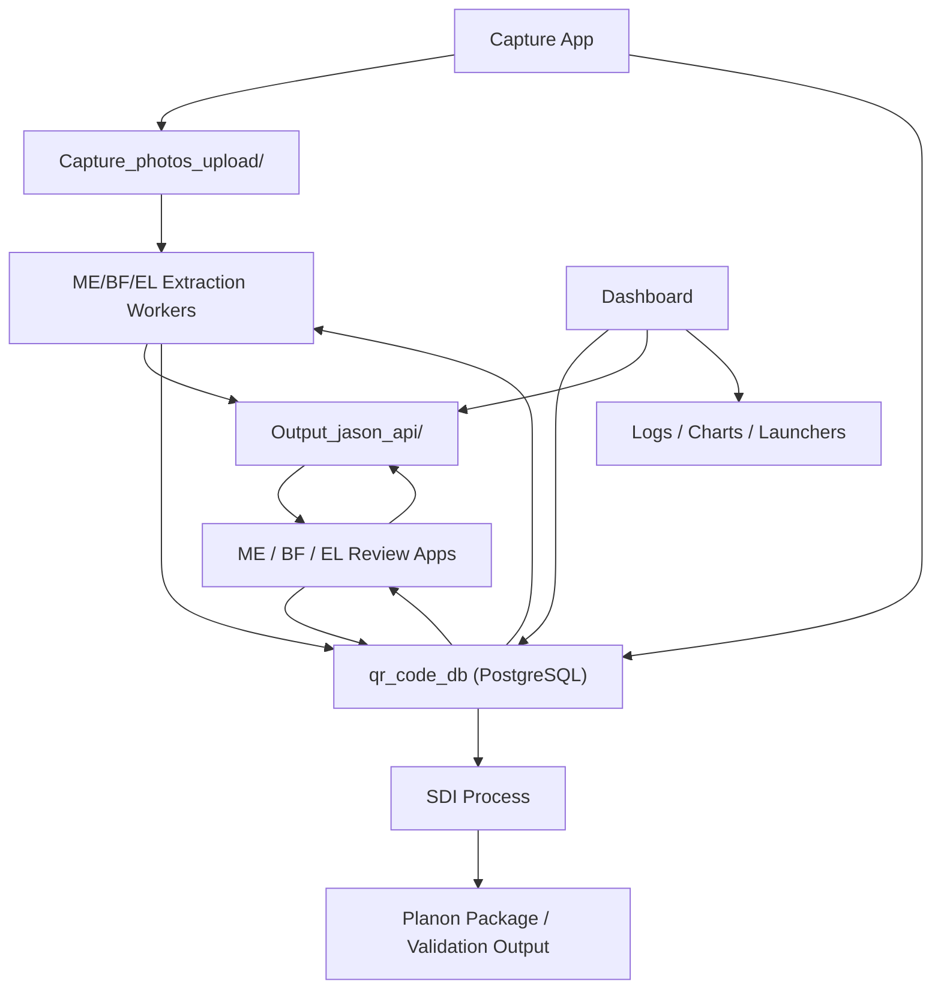

# Platform System Map

> **🐘 Database backend: PostgreSQL (C4 cutover complete, 2026-06-08).** The platform now runs on PostgreSQL (`qr_code_db`, VM `127.0.0.1:5433`) via a backend-agnostic `db.py` layer, switched by `DB_BACKEND=postgres` in `/home/developer/db_backend.env`. The SQLite `QR_codes.db` referenced throughout is now the **frozen rollback** (flip the env back to `sqlite` + restart to revert). See `Markdowns_documentation/special_processes/04_database_topography.md`, `C4_CUTOVER_RUNBOOK.md`, and the `pg-cutover-complete` memory.

Current documentation refresh: 2026-07-25.

This file describes the current runnable modules and the shared stores they use.

## Standard Claude Code Skills

This project standardizes three Claude Code plugins — **Superpowers** (planning / systematic-debugging workflows), **Context7** (up-to-date library docs via MCP), and **Frontend Design** (UI/template work) — enabled in `.claude/settings.json`. Use them when working on any module mapped below; the full usage rules are in `01_GLOBAL_RULES.md` → "Standard Claude Code Skills".

## Runtime Entry Points

| Module | Entry Point | Default Local Port |
| --- | --- | --- |
| Capture App | `asset_capture_app_dev/app.py` | `5001` |
| ME Review | `review/Asset_dasboard_browser_ME/asset_plate_reviewer.py` | `5002` |
| BF Review | `review/Asset_dasboard_browser_BF/asset_plate_reviewer_bf.py` | `5004` |
| EL Review | `review/Asset_dashboard_browser_EL/Asset_dashboard_EL.py` | `8005` |
| Dashboard | `Dashboard/Asset_portal_dashboard.py` | `8002` |
| SDI Process | `SDI_process/app.py` | `8003` |

## Shared Datastores

- Operational DB:
  PostgreSQL `qr_code_db` (VM `127.0.0.1:5433`, via `db.py` / `DB_BACKEND=postgres`); legacy SQLite `asset_capture_app_dev/data/QR_codes.db` is the frozen rollback
- Local development DB:
  PostgreSQL `qr_code_db` on `127.0.0.1:5432`, normally accessed in DBeaver / psql as user `postgres`
- Auth DB:
  `User_control.db` (SQLite, unchanged by the cutover)
- Images:
  `Capture_photos_upload/`
- Extracted JSON:
  `Output_jason_api/`
- SDI validation output:
  `SDI_process/sdi_json_output/`

## Core Data Flow

## Current Table Usage Snapshot

- `QR_codes`
  QR-level state including approval, AI status, SDI exclusion, and location context.
- `QR_code_assets`
  Process-state tracking, image/capture relationships, dashboard tab placement, `user` and `date_hour` audit columns.
- `sdi_dataset`
  Curated ME and BF records used by SDI packaging.
- `sdi_dataset_EL`
  Curated EL records used by SDI packaging.
- `sdi_print_out`
  Active SDI packages.
- `sdi_print_out_arch`
  Archived SDI packages.
- `json_files`
  JSON-level sync / maintenance support.
- `new_device`
  FLS asset tracking with Planon checklist columns (`Request Open`, `Request Date`, `Elapsed Time`, `Complete`, `Ticket Number`) and default `Attribute Set = FireAlarmDevice`.
- `UBC - Asset Data Master Info`
  Dashboard FLS Control Panel lookup by `Property code`; `Code` and `Description` are derived display fields for FLS forms and table rows.
- `Buildings_with_SpaceUID`
  Building and location lookup for capture workflows.
- `life_cycle`
  Life Cycle Assessment main table, rebuilt on every "Update Database" run via pandas `to_sql(if_exists="replace")`. All columns TEXT except `years` (float) and `months` (integer). Built from the source Excel workbook filtered to `Asset Group Code = ME.91.902.4817.5956`, with Floor Name joined from `SpaceUID`. Carries composite FK `life_cycle_space_floor_fkey` to `space_floor`.
- `space_floor`
  Deduplicated reference table (`Property Code`, `Space Number` -> `Floor Name`) built from `SpaceUID` with a PRIMARY KEY; rebuilt on every load.
- `life_cycle_meta`
  Small key/value table that survives the `life_cycle` rebuild; stores the `last_loaded` timestamp shown in the dashboard footer.

## Operational Notes

- Review apps load from JSON plus DB overlays.
- SDI Process packages approved New Assets only: `QR_code_assets.Col_process = 0`.
- Review Update Existing (`Col_process = 1`) and Manual Entry (`Col_process = 2`) stop in review and must not enter SDI packaging.
- SDI Process also excludes rows whose QR code has `QR_codes.sdi = 1`; Manual Entry therefore affects SDI eligibility, not just review-tab display.
- AI extraction now uses chained execution (`run_ai_and_sync.sh`) that auto-runs DB sync after AI processing.
- Planon export parses UBC tag information and formats year-to-date values.
- Validation logs are available through SDI Process for package integrity checks.
- Photos are stored in `Capture_photos_upload/` as `<QR> <Building> <Type> - <Seq>.<ext>`. Per discipline: ME uses `-0..-4` (4 required + optional Extra Photo at `-4`); BF and EL use `-0..-3` (3 required + optional Extra Photo at `-3`). Extra Photo is excluded from AI extraction and "Missed Photo" counts.
- Capture writes apply EXIF Orientation transpose, so uploads post-2026-05-25 are stored upright on disk regardless of how the source camera oriented them.

## Unified Dashboard Shell

The Dashboard now hosts the four process apps (ME, BF, EL, SDI) inside iframe panels rather than launching them in separate browser tabs.

- `Launch App` cards on the Dashboard for `review_me`, `review_bf`, `review_el`, and `sdi_process` navigate to in-page hash views (`#review-me-view`, `#review-bf-view`, `#review-el-view`, `#sdi-view`) instead of opening new tabs.
- Each iframe loads its sub-app at `https://<sub-app-domain>/?embedded=true`.
- Cross-subdomain session sharing is supported because all apps load auth from `/home/developer/auth_service.env` (shared `SECRET_KEY` + `SESSION_COOKIE_DOMAIN=.assetcap.facilities.ubc.ca`) and use `SameSite=None; Secure` on session and remember cookies.
- The sub-apps detect `?embedded=true`, set `g.embedded=True` in a `before_request` hook, and conditionally suppress their own top navbar/header so the central Dashboard chrome is the only navigation surface visible.
- Cross-origin "back to main" navigation uses `window.parent.postMessage({action:'go-to-main'})` from the iframe to the central Dashboard, which switches the hash view.
- Each sub-app injects `?embedded=true` on internal link clicks so the embedded mode persists through navigation inside the iframe.

## Current Analytics Notes

- Dashboard data-quality analytics use discipline-aware completeness and AI-confidence rules.
- Operational Performance Analysis now centers on `Data Quality Comparison`.
- Historical implementation identifiers may still use `cost` / `cost_analysis`; visible labels should read `Performance Analysis`.
- The chart scope toggle is `All` versus `Open Process`.
- FLS charts use Altair for interactive asset management visualization.
- Map chart shows assets distributed by building location.
- SDI flow chart visualizes flow quantity metrics.

## Current Dashboard Extended Features

- Dictionary management UI allows AST-safe editing of the mechanical dictionary directly from the Dashboard.
- FLS asset CRUD supports add, delete, edit, and bulk update of FLS asset records. New FLS Device Flow defaults `Attribute Set` to `FireAlarmDevice` and derives Control Panel Code/Description from `"UBC - Asset Data Master Info"` by building property code and flags multi-match properties while showing the first Code. Rows with a populated `Planon Code` remain editable, but delete and bulk selection are disabled.
- Photo viewing API (`/api/asset-photo/<qr_code>`) serves captured asset photos.
- Enhanced log summarizer parses completeness and confidence from AI processing logs.
- AI Process Queue now surfaces every SLD extraction run as a structured row in `System Logs → SLD Extraction Runs`. The Dashboard reads `/home/developer/sld_extract_feedback/sld_*.jsonl` directly (no DB table for runs). Routes:
  - `GET /sld-logs/runs` — JSON list (used by the in-page Refresh button)
  - `GET /sld-logs/runs/<run_id>` — drilldown page (run summary + DB asset rows + model_call telemetry)
  - `POST /sld-logs/runs/<run_id>/rerun` — admin-only proxy to EL Reviewer's loopback `/sld/api/rerun/<run_id>` (forwards the user's session cookie via stdlib `urllib`, no CORS).
- EL Reviewer adds `POST /sld/api/rerun/<run_id>` — admin-gated re-run that reads the original `run_meta` event from JSONL, recovers the source PDF and building, and reuses the existing extraction wrapper via the new shared helper `_run_extraction(filename, building_code, replace)` in `sld_blueprint.py`.
- Cross-service env var `DASHBOARD_ADMIN_USERS` (already in `auth_service.env`) is the single source of truth for who can re-run; both apps mirror the same lookup.
- EL Reviewer adds `POST /sld/api/assets/<row_id>/reconcile` — resolves `Supply From` divergence between `electrical_building_schema` (diagram) and `sdi_dataset_EL` (captured asset). Body `{choice: "sld"|"sdi"|"custom", value?, reason?}`. Atomic dual-write: SLD via SQL, SDI via the JSON file + `_sync_db_from_structured`, JSON+SDI guarded by `json_sync_lock` with rollback. Each side that changes emits an `audit_trail` row (`source="human"`, `description="reconcile:<choice>"`). Surfaced in the SLD panel's "Reconciliation" column (previously "Check") as a clickable red ✗ button on rows where the two sides disagree but a matching QR exists.
- `electrical_building_schema.ID_check` and `sdi_dataset_EL.ID_check` are PostgreSQL `GENERATED ALWAYS AS (...) STORED` columns. The Reconciliation status is structurally derived from the live values, removing a class of staleness bugs where the inline editor could leave `ID_check` out of sync after a `Supply From` edit. The old SQLite `VIRTUAL` generated-column wording is rollback/reference history only.
- Life Cycle Assessment is an in-process Flask Blueprint (`life_cycle`) mounted inside the Dashboard app (`Asset_portal_dashboard.py`) at `url_prefix=/life-cycle` — not a separate service or port; it runs as part of the `assetcap-dashboard` gunicorn service (port `8002`, `dashboardprod.assetcap.facilities.ubc.ca`). Registration is wrapped in try/except so a missing dependency degrades to "feature absent" without crashing the portal. It surfaces asset age / life-cycle data for the Mechanical asset group `ME.91.902.4817.5956` (Heating Water Storage Tanks), splitting rows into Complete / Incomplete tabs (Installation Date is the only completeness criterion: present is Complete, missing is Incomplete) with an Age Classification **donut chart** (Good <=8 yrs, Caution 8-10 yrs, Critical >=10 yrs, Unknown no installation date) plus a companion **Life-cycle Expiry** bar chart (X = installation year + 10, the year an asset reaches 10 yrs of service; Y = years in service with a dashed 10-yr line; bars coloured by age band).
  - Code layout: `Dashboard/life_cycle/` package — `__init__.py` (exports `life_cycle_bp`), `blueprint.py` (routes + data access), `completeness.py` (shared Complete / Incomplete rule), `excel_export.py` (styled XLSX export), `static/css/styles.css`, `static/js/dashboard.js`, `static/img/ubc-facilities_logo.jpg`, `templates/life_cycle/dashboard.html`.
  - `life_cycle_pipeline/` package (sibling of `Dashboard`; on the VM at `/home/developer/life_cycle_pipeline`) — `track_assets.py` (builds a DataFrame from the Excel workbook, joins Floor Name from `SpaceUID`), `load_life_cycle.py` (loads into PostgreSQL, Excel -> PostgreSQL), `"UBC - Asset Basic Info.xlsx"` (default source workbook), `__init__.py`.
  - Routes (all under `/life-cycle`): `GET /life-cycle/` (HTML page; requires login + `lifecycle_assessment` viewer permission), `POST /life-cycle/export` (styled XLSX of the visible rows), `POST /life-cycle/refresh` (uploads an Excel workbook and rebuilds the tables; destructive — drops/rebuilds `life_cycle` + `space_floor`, requires DDL privileges for the `assetcap_app` DB user), `GET /life-cycle/health` (open, no auth — liveness probe). Blueprint static is served at `/life-cycle/static/...`.
  - RBAC: a new `operations` section / `lifecycle_assessment` item in `auth_service/app_registry.py`; routes enforce it via `has_permission` / `require_permission` (same server-side model as FLS Devices — the sidebar link itself is not visibility-gated), granted per-user (viewer/editor) through the Dashboard User Admin screen.
  - Navigation: a "Life Cycle Assessment" item in the shared shell sidebar (`Dashboard/static/shell/shell.js`) under the "Operations" group, directly below "FLS Devices", icon `activity`, linking to the standalone `/life-cycle/` page; the nav entry + breadcrumb (Home / Operations / Life Cycle Assessment) were propagated to all five `shell.js` copies (Dashboard, ME/BF/EL reviewers, SDI Process), cache-busted via the `?v=` query in each app's `_shell.html`.
  - DB config: the connection is derived from a single source — env var `LIFE_CYCLE_DSN` (libpq DSN) if set, else the portal's `QR_PG_DSN`, else the dev sandbox default. The SQLAlchemy URL `LIFE_CYCLE_SA_DSN` (used by `track_assets.py` and `load_life_cycle.py`) is derived from that libpq DSN at blueprint import. The footer "Source: <db>.life_cycle" shows the actual DB name parsed from the live DSN (`qr_code_db` in prod).
  - At read time the page also derives a "Captured" flag (QR present in `QR_codes` with a `date_set` — i.e. field-captured) and a "Capture Date" (`QR_codes.date_set`) per row; those existing tables are read-only inputs.
  - Dependencies (on top of Flask): pandas, numpy, sqlalchemy, openpyxl, psycopg2(-binary), Pillow (added to `Dashboard/requirements.txt`). Integrated and deployed to production 2026-06-23.
