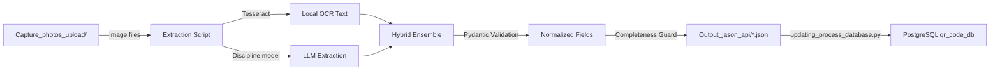

# Industrial Asset Extraction API — Agent Instructions

Current documentation refresh: 2026-06-11.

## Application Identity

The **Asset Extraction API** is a suite of Python scripts that process photographs of industrial equipment nameplates. Using local OCR (Tesseract) and discipline-specific OpenAI multimodal models, it extracts structured technical data (Manufacturer, Model, Serial, Ratings) and writes the results as JSON files for downstream review and database import.

**Production Server**: Ubuntu (resolved via $DEV_PATH, typically `/home/developer/API/`)
**Local Dev**: Windows at `C:\Users\gandrade\Documents\asset_full_dummy_version\API\`

---

## Architecture Overview

```
API/
├── API_interface_ME_ver00.py       # Mechanical asset extraction (1940 lines, ver04)
├── API_interface_EL_ver00.py       # Electrical asset extraction (532 lines)
├── API_interface_BF_ver00.py       # Backflow asset extraction (567 lines)
├── validators_shared.py           # Shared normalization functions (179 lines)
├── updating_process_database.py   # DB sync: JSON -> PostgreSQL (213 lines)
├── response_schema.json           # Canonical JSON output schema
├── requirements.txt               # Python dependencies
├── auto_process_assets.sh         # Cron automation: EL → ME → DB sync
├── run_ai_and_sync.sh             # Dashboard launcher: AI script + DB sync
├── run_interpreter.sh             # venv wrapper for arbitrary Python
├── OpenAI_key_giba.env            # API key env file used by all AI extraction scripts
├── OpenAI_key_<user>.env          # Optional user-specific env files (not loaded by default)
└── .agent/                        # This documentation directory
    ├── AGENT.md                   # ← You are here
    ├── RULES.md                   # Coding standards & rules
    ├── api_comparison_matrix.md   # Side-by-side ME/BF/EL comparison
    ├── skills/run_extraction/     # Extraction skill docs
    └── workflows/                 # Step-by-step operational workflows
```

---

## Data Flow



---

## Extraction Scripts

All three scripts share an identical OOP architecture:

| Component | Class/Function | Purpose |
|-----------|---------------|---------|
| `Config` | Class | Centralized paths, env vars, regex patterns, concurrency settings |
| `*StructuredExtraction` | Pydantic `BaseModel` | Strict JSON schema for LLM output with field validators |
| `setup_environment()` | Function | Loads `.env`, configures Tesseract path (cross-platform) |
| `AssetProcessor` | Class | Main orchestrator with `discover_assets()`, `process_single_asset()`, `run()` |

### Mechanical (ME) — `API_interface_ME_ver00.py`

| Attribute | Value |
|-----------|-------|
| **Key Fields** | Manufacturer, Model, Serial Number, Year, UBC Tag, Technical Safety BC |
| **Image Sequences** | 0 (Nameplate), 1 (UBC Tag), 3 (Technical Safety BC) — seq 2 (Main Asset Photo) and seq 4 (**Extra Photo**) are captured but excluded from `VALID_SUFFIXES` |
| **Filename Regex** | `[0-4]` (widened so Extra Photo can be discovered + logged as `invalid_seq`) |
| **VALID_SUFFIXES** | `{"0", "1", "3"}` |
| **OCR Strategy** | Hybrid — Context Injection + **ver04 Vertical Text fix** (rotates sequences 0, 1, 3) |
| **Special Logic** | FCU MI/M1/ML disambiguation, tag-vs-model guardrail, manufacturer OCR recovery, TSBC `UNIT NO.` crop-first targeted reread with `PV`/six-digit validation, **ver04 Hallucination Defense** (UBC Tag regex + Serial negative prompts) |
| **Pydantic Model** | `MEStructuredExtraction`, `MEReasonedExtraction` |
| **Completeness Fields** | Manufacturer, Model, Serial Number, Year, UBC Tag (+ Technical Safety BC when seq 3 exists) |
| **Lines** | ~1,940 |

### Electrical (EL) — `API_interface_EL_ver00.py`

| Attribute | Value |
|-----------|-------|
| **Key Fields** | UBC Asset Tag, Ampere, Volts, Fed From, Phase, Location |
| **Image Sequences** | 0 (Asset Plate/Label — optional), 1 (UBC Asset Tag), 2 (Panel Schedule) — seq 3 (**Extra Photo**) is captured but excluded from `VALID_SUFFIXES` |
| **Filename Regex** | `[0-3]` (widened so Extra Photo can be discovered + logged as `invalid_seq`) |
| **VALID_SUFFIXES** | `{"0", "1", "2"}` |
| **OCR Strategy** | Hybrid — Context Injection |
| **Special Logic** | `PNL-` prefix enforcement, panel tag formatting (CDP-6-N-1-L-1), `_apply_tag_formatting()` |
| **Pydantic Model** | `ELStructuredExtraction` |
| **Panel Abbreviations** | MDP, CDP, SPL, MCC, PNL, SWBD, ATS |
| **Lines** | ~532 |

### Backflow (BF) — `API_interface_BF_ver00.py`

| Attribute | Value |
|-----------|-------|
| **Key Fields** | Manufacturer, Model, Serial Number, Diameter |
| **Image Sequences** | 0 (Nameplate), 1 (Context) — **2 images go to LLM**; seqs 2 (Main Photo) and 3 (**Extra Photo**) are captured but excluded from `VALID_SUFFIXES` |
| **Filename Regex** | `[0-3]` (widened so seqs 2 and 3 can be discovered + logged as `invalid_seq`) |
| **VALID_SUFFIXES** | `{"0", "1"}` |
| **OCR Strategy** | Hybrid — Extreme Optimized (4 OCR calls/image via rotations + PSM modes) |
| **Special Logic** | Diameter suffix enforcement (`"`), shared manufacturer validation |
| **Pydantic Model** | `BFStructuredExtraction` |
| **Lines** | ~567 |

---

## Shared Utilities

### `validators_shared.py`

Centralized normalization functions imported by all three scripts (DRY principle):

| Function | Used By | Purpose |
|----------|---------|---------|
| `normalize_manufacturer()` | ME, BF | Title-case, match against `VALID_MANUFACTURERS` set |
| `normalize_model()` | ME, BF | Strip special chars, FCU MI/M1/ML correction |
| `normalize_serial()` | ME, BF | Alphanumeric cleanup, cap at 64 chars |
| `normalize_year()` | ME | Extract 4-digit year in 1950–2026 range |
| `normalize_ubc_tag()` | ME, EL | Alphanumeric + dash cleanup, cap at 32 chars |
| `normalize_diameter()` | BF | Parse fractional/decimal inches, ensure `"` suffix |
| `normalize_ampere()` | EL | Extract digits + `A` suffix |
| `normalize_volts()` | EL | Parse compound voltages; returns the bare value (e.g., `208/120V` -> `208/120`; unit lives in `Voltage Rating (UoM)`) |
| `normalize_supply_from()` | EL | Whitespace normalization, cap at 80 chars |
| `normalize_panel_tag()` | EL | Enforce panel tag grammar (CDP-6-N-1-L-1) |
| `normalize_description()` | — | Simple truncation at 120 chars |
| `completeness_score()` | ALL | Percentage of non-empty required fields |

### `updating_process_database.py`

Post-extraction DB synchronization:
1. **`process_jpg_files()`** — Scans `Capture_photos_upload/` for image metadata
2. **`update_qr_codes_table()`** — Updates `date_set` column in `QR_codes` table
3. **`process_json_files()`** — Reads JSON output files and builds DataFrame
4. **`save_JSON -> PostgreSQL()`** — Saves DataFrame to `json_files` table

---

## Shell Scripts (Production — Ubuntu)

| Script | Purpose | Triggered By |
|--------|---------|-------------|
| `auto_process_assets.sh` | Runs EL → ME → DB sync sequentially | Cron job |
| `run_ai_and_sync.sh` | Runs one AI script (passed as `$1`) + DB sync | Dashboard task runner |
| `run_interpreter.sh` | venv wrapper for arbitrary Python commands | Dashboard remote exec |

---

## Environment Variables

| Variable | Required | Default | Description |
|----------|----------|---------|-------------|
| `OPENAI_API_KEY` | **Yes** | — | OpenAI API authentication |
| `DEV_PATH` | No | `/home/developer` | Root path for all operations |
| `ME_PRIMARY_LLM_MODEL` | No | `gpt-5.4-mini` | Mechanical extraction model |
| `BF_PRIMARY_LLM_MODEL` | No | `gpt-5.4-mini` | Backflow extraction model |
| `EL_PRIMARY_LLM_MODEL` | No | `gpt-5.4` | Electrical extraction model |
| `<TYPE>_ENABLE_LLM_FALLBACK` | No | `false` | Explicitly re-enable model fallback for ME, BF, or EL |
| `<TYPE>_MAX_LLM_ATTEMPTS_PER_ASSET` | No | `1` | Maximum models attempted for one asset |
| `<TYPE>_MAX_LLM_ATTEMPTS_PER_MODEL` | No | `1` | Maximum API attempts for the selected model |
| `ME_OCR_MODE` | No | `light` | OCR strategy: `off`, `light`, `full` |
| `ME_HYBRID_OCR_AGENT` | No | `1` | Enable hybrid OCR context injection |
| `ME_OCR_CONTEXT_MAX_CHARS` | No | `4500` | Max OCR context chars for LLM prompt |
| `BF_OCR_MODE` | No | `full` | BF OCR strategy |
| `BF_API_MAX_RETRIES` | No | `3` | BF API call retry limit |
| `BF_API_RETRY_DELAY` | No | `1.5` | BF retry delay in seconds |

---

## CLI Arguments

All three extraction scripts accept:

| Argument | Example | Description |
|----------|---------|-------------|
| `--qr <code>` | `--qr 0000177289` | Process a single QR code (bypasses ai_status filter) |
| `--debug` | `--debug` | Enable verbose logging with raw LLM responses |
| `--images-dir <path>` | `--images-dir /tmp/imgs` | Override input image directory |
| `--output-dir <path>` | `--output-dir /tmp/out` | Override JSON output directory |
| `--db <path>` | `--db /tmp/test.db` | Legacy rollback/testing SQLite path only; production uses `DB_BACKEND=postgres` / `QR_PG_DSN`. |

---

## Key Conventions

1. **OOP Pattern**: Every script uses an `AssetProcessor` class — never add loose functions for processing logic
2. **Config Class**: All paths, constants, and env vars live in the `Config` class — no global variables
3. **Shared Validators**: Use `validators_shared.py` for any normalization — never duplicate logic
4. **Completeness Guard**: Never overwrite JSON with lower-quality data — only save if `new_score >= existing_score`
5. **Cross-Platform Paths**: Use `os.getenv("DEV_PATH")` and `os.path.join()` — never hardcode `/home/developer/`
6. **Logging Standard**: Console summary lists only saved assets in format: `- QR: {qr} | {TYPE} | {TIMESTAMP} | Building: {building}`
