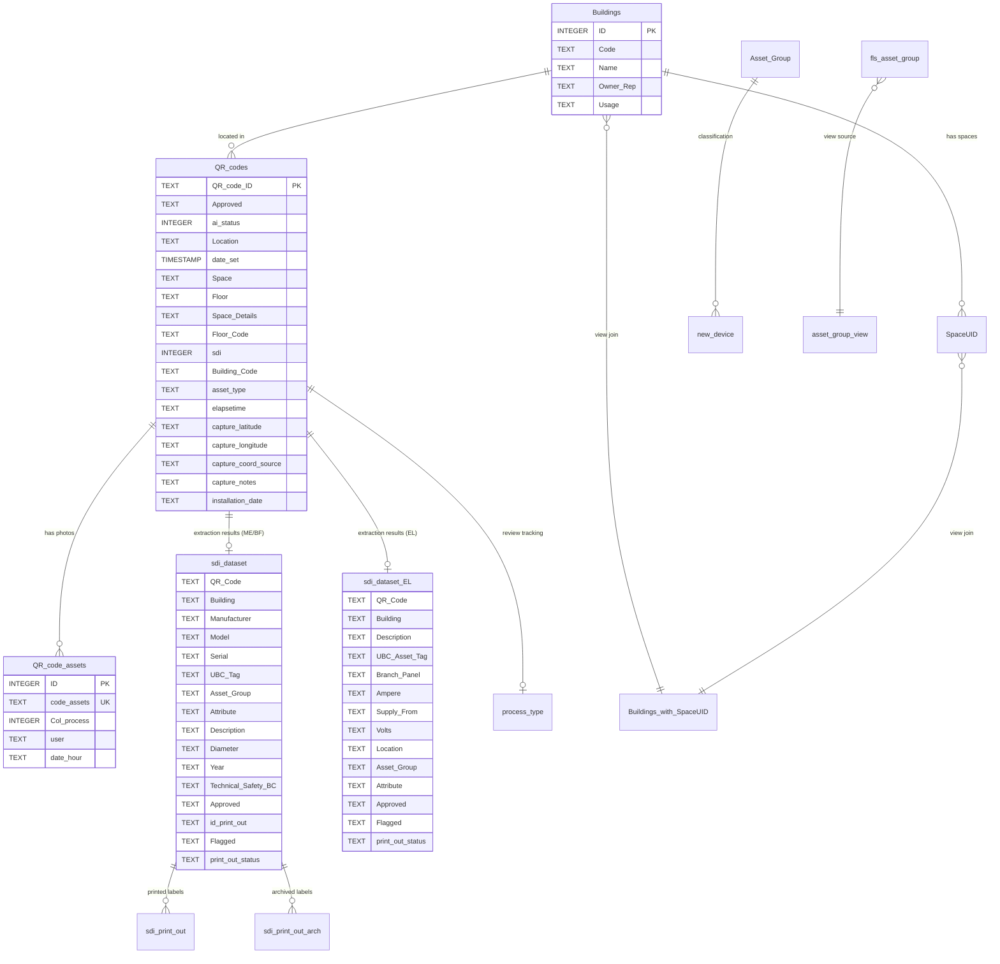

# QR_codes.db — Complete Database Schema

Current documentation refresh: 2026-04-28.

> **Location**: `asset_capture_app_dev/data/QR_codes.db`
> **Engine**: SQLite 3 (with WAL journaling mode)
> **Size**: ~8 MB

---

## Entity Relationship Diagram



---

## Tables

### Core Capture Tables

#### `QR_codes` — Master QR Code Registry
| Column | Type | PK | Default | Description |
|--------|------|----|---------|-------------|
| QR_code_ID | TEXT | ✅ | — | 10-digit QR code or `TEMP-XXXXX` |
| Approved | TEXT | | — | Approval status from reviewer |
| ai_status | INTEGER | | — | `1` = extraction data exists, `0` = not yet |
| Location | TEXT | | — | Full location string (`Space Floor Details`) |
| date_set | TIMESTAMP | | — | Record creation/update timestamp |
| Space | TEXT | | — | First word of Location (auto-filled by trigger) |
| Floor | TEXT | | — | Last word of Location (auto-filled by trigger) |
| Space Details | TEXT | | — | Middle words of Location (auto-filled by trigger) |
| Floor Code | TEXT | | — | Floor code from `Buildings_with_SpaceUID` (auto-filled) |
| sdi | INTEGER | | `0` | SDI processing flag (auto-filled by trigger) |
| Building Code | TEXT | | — | Building code reference |
| asset_type | TEXT | | — | ME, EL, or BF |
| elapsetime | TEXT | | — | Capture session elapsed time |

**Row count**: ~600

> **GPS capture (2026-06-16):** three columns added to `QR_codes` on PostgreSQL via owner-run migrations — `capture_latitude`, `capture_longitude` (decimal-degree TEXT), and `capture_coord_source` (`device` | `building` | `''`). Populated by the mobile Capture App `/submit` (precise device GPS, else a building-centroid fallback). Not present on the frozen SQLite rollback unless its `ALTER TABLE` statements are applied.

> **Optional capture details (2026-07-06):** two more columns added via owner-run migration `scripts/migrations/2026-07-06_qr_codes_capture_notes_install_date.sql` — `capture_notes` (free text from the field tech, server-clamped to 200 chars) and `installation_date` (ISO `YYYY-MM-DD` TEXT, set only after an explicit confirm tap in the UI). Populated by the mobile Capture App `/submit`; latest non-empty submission wins, an empty resubmission never erases a stored value. Both keys are also written to the `{qr}_et.json` payload.

---

#### `QR_code_assets` — Photo File Records
| Column | Type | PK | Default | Description |
|--------|------|----|---------|-------------|
| ID | INTEGER | ✅ | AUTO | Row identifier |
| code_assets | TEXT | | — | Filename base (e.g., `0000177276 314-1 ME - 0`) |
| Col_process | INTEGER | | — | Processing status flag |
| user | TEXT | | — | Username who captured |
| date_hour | TEXT | | — | Capture timestamp |

**Unique Index**: `ux_QR_code_assets_code_assets` on `code_assets`
**Row count**: ~1,637

---

#### `temp_code` — Temporary QR Code Pool
| Column | Type | PK | NotNull | Description |
|--------|------|----|---------|-------------|
| ID | INTEGER | ✅ | ✅ | Row identifier |
| temp_code | TEXT | | | Temporary code (`TEMP-XXXXX`) |
| status | INTEGER | | | `0` = available, `1` = used |

**Row count**: 20,000

---

### Extraction Result Tables

#### `sdi_dataset` — Mechanical / Backflow Extraction Data
| Column | Type | Default | Description |
|--------|------|---------|-------------|
| QR Code | (untyped) | — | QR code reference |
| Building | (untyped) | — | Building code |
| Manufacturer | (untyped) | — | Equipment manufacturer |
| Model | (untyped) | — | Equipment model |
| Serial | (untyped) | — | Serial number |
| UBC Tag | (untyped) | — | UBC asset tag |
| Asset Group | (untyped) | — | Asset classification group |
| Attribute | (untyped) | — | Asset attribute code |
| Description | (untyped) | — | Asset description |
| Diameter | (untyped) | — | Pipe/equipment diameter |
| Year | (untyped) | — | Year of manufacture/install |
| Technical Safety BC | (untyped) | — | Technical Safety BC number |
| Approved | (untyped) | — | Reviewer approval status |
| id_print_out | TEXT | — | Link to print-out record |
| Flagged | TEXT | `'0'` | Flagged for review |
| print_out_status | TEXT | — | SDI label print status |

**Row count**: ~430

---

#### `sdi_dataset_EL` — Electrical Extraction Data
| Column | Type | Default | Description |
|--------|------|---------|-------------|
| QR Code | (untyped) | — | QR code reference |
| Building | (untyped) | — | Building code |
| Description | (untyped) | — | Panel description |
| UBC Asset Tag | (untyped) | — | UBC asset tag |
| Branch Panel | (untyped) | — | Branch panel identifier |
| Ampere | (untyped) | — | Amperage rating |
| Supply From | (untyped) | — | Supply source |
| Volts | (untyped) | — | Voltage rating |
| Location | (untyped) | — | Panel location |
| Asset Group | (untyped) | — | Asset classification group |
| Attribute | (untyped) | — | Asset attribute code |
| Approved | (untyped) | — | Reviewer approval status |
| Flagged | TEXT | `'0'` | Flagged for review |
| print_out_status | TEXT | — | SDI label print status |

**Row count**: ~171

---

### SDI Label Tables

#### `sdi_print_out` — Active Printed Labels
22 columns covering all asset fields + print metadata (`print_out`, `date`, `time`, `id_print_out`, `Space`, `Floor Code`).

**Row count**: ~50

#### `sdi_print_out_arch` — Archived Printed Labels
Identical schema to `sdi_print_out` — stores historical label records after archiving.

**Row count**: ~307

#### `sdi_sequence` — Print-Out Sequence Counter
| Column | Type | Description |
|--------|------|-------------|
| last_value | INTEGER | Next print-out ID to assign |

**Row count**: 1

---

### Reference / Lookup Tables

#### `Buildings` — Building Directory
| Column | Type | PK | Description |
|--------|------|----|-------------|
| ID | INTEGER | ✅ | Auto-increment ID |
| Code | TEXT | | Building code (e.g., `314-1`) |
| Name | TEXT | | Building name |
| Owner Rep | TEXT | | Owner representative |
| Usage | TEXT | | Building usage type |

**Row count**: 294

---

#### `SpaceUID` — Space / Room Registry
| Column | Type | Description |
|--------|------|-------------|
| Space number | TEXT | Space identifier |
| Property.Property code | TEXT | Building code (FK to `Buildings.Code`) |
| Floor Code | INTEGER | Floor number |
| Space Name | TEXT | Room/space name |
| Floor Name | TEXT | Floor description |

**Row count**: 85,881

---

#### `Asset_Group` — Asset Classification Hierarchy
| Column | Type | Description |
|--------|------|-------------|
| Full Classification | TEXT | Full classification path |
| Code | INTEGER | Classification code |
| Name | TEXT | Group name |
| Level | TEXT | Hierarchy level |

**Row count**: 338

---

#### `Attribute` — Asset Attribute Codes
| Column | Type | Description |
|--------|------|-------------|
| Code | TEXT | Attribute code |
| Attribute | TEXT | Attribute description |

**Row count**: 12

---

#### `bf_applicaton_type` — Backflow Application Types
| Column | Type | Description |
|--------|------|-------------|
| Code | TEXT | Application code |
| Application | TEXT | Application description |

**Row count**: 5

---

#### `fls_asset_group` — FLS Asset Classification
| Column | Type | Description |
|--------|------|-------------|
| Full Classification | TEXT | Full path |
| Code | INTEGER | Code |
| Name | TEXT | Name |
| Level | TEXT | Level |
| Level 1–5 | TEXT | Hierarchy levels |
| Device Type | TEXT | Device type category |

**Row count**: 42

---

#### `main_asset_description` — Main Asset Lookup
| Column | Type | Description |
|--------|------|-------------|
| main_asset | TEXT | Main asset description |

**Row count**: 47

---

#### `UBC - All Properties List with GPS Coordinates` — Full Property Registry
21 columns including `Code`, `Name`, `Address`, `GPS Coordinates`, `Latitude`, `Longitude`, `Campus`, `Zone`.

**Row count**: 1,264

---

#### `UBC - Asset Data Master Info` — Master Asset Records
15 columns including `Code`, `Description`, `Asset Group`, `Asset Tag`, `Property code`, `Space Number`, `Main Asset Code`, `External QR Code`.

**Row count**: 150

---

### Tracking Tables

#### `json_files` — JSON Processing Log
| Column | Type | Description |
|--------|------|-------------|
| code | TEXT | QR code |
| create_date | TEXT | JSON file creation date |

**Row count**: 596

---

#### `process_type` — Review Process Tracking
| Column | Type | Description |
|--------|------|-------------|
| QR Code | TEXT | QR code reference |
| review_id | TEXT | Reviewer assignment |
| user_name | TEXT | Reviewer username |
| last_modification | TEXT | Last update timestamp |

**Row count**: 602

---

#### `new_device` — FLS New Device Tracking
| Column | Type | Default | Description |
|--------|------|---------|-------------|
| Asset Tag | TEXT | — | Device asset tag |
| Asset Group | TEXT | — | Classification group |
| Description | TEXT | — | Device description |
| Property | TEXT | — | Building/property |
| Space | TEXT | — | Space location |
| Attribute Set | TEXT | — | Attribute set |
| Device Address | TEXT | — | Device address |
| Device Type | TEXT | — | Device type |
| UN Account Number | TEXT | — | Account number |
| Status | INTEGER | — | Processing status |
| index | INTEGER | — | Unique index |
| Work Order | INTEGER | — | Work order number |
| Creation Date | TEXT | — | Record creation date |
| Planon Code | TEXT | — | Planon system code |
| Workflow | TEXT | — | Workflow status |
| Space Details | TEXT | — | Additional space info |
| Request Open | INTEGER | `0` | Request open flag |
| Request Date | TEXT | — | Request date |
| Elapsed Time | INTEGER | `0` | Elapsed time |
| Complete | INTEGER | `0` | Completion flag |
| Ticket Number | TEXT | — | Service ticket number |

**Unique Index**: `idx_index` on `index`
**Row count**: 129

---

#### `sqlite_sequence` — Auto-Increment Tracker
Internal SQLite table for tracking AUTOINCREMENT sequences.

---

## Indices

| Index Name | Table | Columns | Unique |
|------------|-------|---------|--------|
| `sqlite_autoindex_QR_codes_1` | `QR_codes` | `QR_code_ID` | ✅ (PK) |
| `ux_QR_code_assets_code_assets` | `QR_code_assets` | `code_assets` | ✅ |
| `idx_index` | `new_device` | `index` | ✅ |

---

## Views

### `Buildings_with_SpaceUID`
Joins `Buildings` with `SpaceUID` on `Code = Property.Property code` to produce location strings.

```sql
SELECT b.*, s."Space number", s."Space Name", s."Floor Name",
       TRIM(COALESCE(s."Space number",'') || ' ' || 
            COALESCE(s."Space Name",'') || ' ' || 
            COALESCE(s."Floor Name",'')) AS "Location",
       s."Floor Code"
FROM Buildings b
LEFT JOIN SpaceUID s ON b."Code" = s."Property.Property code"
```

**Used by**: Location dropdowns in capture app, Floor Code triggers.

---

### `Asset_System_info`
Joins `UBC - Asset Data Master Info` with `SUST - System List` on `Main Asset Code = Asset Code`.

**Used by**: Dashboard asset system lookups.

---

### `Sorted by name`
Simple passthrough: `SELECT * FROM Buildings` (presumably for sorted access).

---

### `asset_group_view`
Combines `Name` and `Full Classification` from `fls_asset_group` for dropdown display.

```sql
SELECT CASE
    WHEN Name IS NOT NULL AND "Full Classification" IS NOT NULL
        THEN Name || ' | ' || "Full Classification"
    WHEN Name IS NULL THEN "Full Classification"
    ELSE Name
END AS "Asset Group"
FROM "fls_asset_group"
```

**Used by**: FLS asset group dropdowns in Dashboard.

---

## Triggers

### `auto_fill_all_on_insert` (on `QR_codes` INSERT)
When a new QR code is inserted, automatically populates:
- **Space** — first word of Location
- **Floor** — last word of Location (via JSON array extraction)
- **Space Details** — middle words of Location
- **Floor Code** — looked up from `Buildings_with_SpaceUID` view
- **date_set** — populated with `DATETIME('now')` if null

---

### `auto_fill_all_on_update` (on `QR_codes` UPDATE of Location)
Same logic as `auto_fill_all_on_insert` but fires when `Location` column is updated. Recalculates Space, Floor, Space Details, and Floor Code.

---

### `T_set_ai_status` (on `QR_codes` INSERT)
Sets `ai_status = 1` if the QR code exists in `sdi_dataset` or `sdi_dataset_EL`, otherwise sets `ai_status = 0`.

---

### `trg_qr_codes_sdi_default_zero` (on `QR_codes` INSERT)
When `sdi` is NULL after insert, defaults it to `0`.

---

### `trg_sync_process_type_dataset` (on `sdi_dataset` INSERT)
When a new extraction result is inserted, automatically creates a matching row in `process_type` if one doesn't exist.

---

### `trg_sync_process_type_dataset_EL` (on `sdi_dataset_EL` INSERT)
Same as above but for electrical extraction results.

---

## Foreign Key Relationships

> **Note**: No explicit `FOREIGN KEY` constraints are defined in the schema. Relationships are maintained by application logic and trigger synchronization.

### Logical Relationships (Enforced by Code)

| Parent Table | Child Table | Join Logic |
|-------------|-------------|------------|
| `QR_codes.QR_code_ID` | `QR_code_assets.code_assets` | code_assets starts with QR_code_ID |
| `QR_codes.QR_code_ID` | `sdi_dataset."QR Code"` | Direct match |
| `QR_codes.QR_code_ID` | `sdi_dataset_EL."QR Code"` | Direct match |
| `QR_codes.QR_code_ID` | `process_type."QR Code"` | Direct match (trigger-synced) |
| `Buildings.Code` | `SpaceUID."Property.Property code"` | Building code match |
| `Buildings.Code` | `QR_codes."Building Code"` | Building code match |
| `sdi_dataset."QR Code"` | `sdi_print_out."QR Code"` | Direct match |
| `sdi_dataset."QR Code"` | `sdi_print_out_arch."QR Code"` | Direct match |

---

## Data Flow

```
1. Field Technician scans QR → INSERT into QR_codes
                                 ├── Triggers: auto_fill_all (Space, Floor, Floor Code)
                                 ├── Triggers: T_set_ai_status (check sdi_dataset)
                                 └── Triggers: trg_sdi_default_zero (sdi = 0)

2. Photos captured → INSERT into QR_code_assets
                      └── Files saved: <QR> <Building> <Type> - <Seq>.jpg

3. AI Extraction runs → INSERT into sdi_dataset or sdi_dataset_EL
                          └── Trigger: trg_sync_process_type_dataset (creates process_type row)

4. Reviewer approves → UPDATE sdi_dataset.Approved or sdi_dataset_EL.Approved

5. SDI Label printed → INSERT into sdi_print_out
                         └── Later archived → MOVE to sdi_print_out_arch
```
