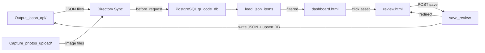

# Asset Plate Review Apps — Agent Instructions

Current documentation refresh: 2026-06-24.

## Embedded Mode

Each review app runs both standalone (its own subdomain) and embedded inside the central Dashboard's iframe. Embedded mode is requested by `?embedded=true` and detected by a `before_request` hook (`g.embedded = ...`). When embedded, the templates suppress their own user-nav, brand header, and user dropdown via `` while keeping all functional controls visible. A small bottom-of-body script preserves `?embedded=true` on internal `<a>` clicks. Cookie config (`SameSite=None; Secure`) is required for cross-subdomain session delivery from the Dashboard. EL has three templates that need this treatment (`landing.html`, `dashboard.html`, `review.html`); ME and BF have two (`dashboard.html`, `review.html`). See `Markdowns_documentation/rules/review_apps.rules.md` for the full rule set.

## Application Identity

The **Asset Plate Review** suite consists of three Flask web applications that allow trained reviewers to inspect, correct, and approve structured data extracted from industrial equipment nameplates. Each app serves one asset discipline:

| App | Script | Port | Asset Type |
|-----|--------|------|------------|
| **ME** | `Asset_dasboard_browser_ME/asset_plate_reviewer.py` | 5002 | Mechanical |
| **BF** | `Asset_dasboard_browser_BF/asset_plate_reviewer_bf.py` | 5003 | Backflow |
| **EL** | `Asset_dashboard_browser_EL/Asset_dashboard_EL.py` | 5004 | Electrical |

**Production URLs**: `https://me-review.assetcap.facilities.ubc.ca`, `https://bf-review.assetcap.facilities.ubc.ca`, `https://el-review.assetcap.facilities.ubc.ca`
**Local**: `http://127.0.0.1:<port>`

---

## Architecture Overview

All three apps share the same directory pattern:

```
review/
├── .agent/                          # This documentation directory
├── Asset_dasboard_browser_ME/       # Mechanical review app
│   ├── asset_plate_reviewer.py      # Flask app (1411 lines, 54 functions)
│   ├── gps_service.py               # GPS coordinate lookup blueprint
│   ├── requirements.txt             # Python dependencies
│   ├── review_asset_templates/      # Jinja2 templates
│   │   ├── dashboard.html           # Main dashboard SPA (filterable table + tabs)
│   │   ├── review.html              # Single-asset review/edit form
│   │   ├── login.html               # Authentication page
│   │   ├── macros/                  # Reusable Jinja2 macros
│   │   └── static/                  # CSS, JS, images
│   └── venv/                        # Python virtual environment
├── Asset_dasboard_browser_BF/       # Backflow review app
│   ├── asset_plate_reviewer_bf.py   # Flask app (2017 lines, 75 functions)
│   ├── gps_service.py               # GPS blueprint (identical across apps)
│   ├── review_asset_templates/      # Templates (same structure)
│   └── venv/
└── Asset_dashboard_browser_EL/      # Electrical review app
    ├── Asset_dashboard_EL.py        # Flask app (1981 lines, 69 functions)
    ├── gps_service.py               # GPS blueprint (identical across apps)
    ├── requirements.txt             # Python dependencies
    ├── review_asset_templates/      # Templates (same structure)
    └── venv/
```

### Blueprints (per app)

| Blueprint | Prefix | Purpose |
|-----------|--------|---------|
| `auth`    | `/`    | Login, logout (Flask-Login + bcrypt via shared `auth_service`) |
| `gps_service` | `/api/building_location/` | GPS coordinate lookup from PostgreSQL `qr_code_db` |

> **Note (EL only):** The EL app also uses a `main` Blueprint that wraps the main routes.

---

## Data Flow



### Directory Sync (before_request)

On every request, each app runs two sync functions:
1. **Image Sync** (`sync_image_directory_to_db`) — Scans `Capture_photos_upload/` for new images matching the app's `IMG_NAME_RE*` pattern (e.g., `<QR> <Building> ME - 0.jpg`) and registers them in `QR_codes` / `QR_code_assets`. The regex accepts the full sequence range including the optional Extra Photo: ME `[0-4]`, BF `[0-3]`, EL `[0-3]`.
2. **JSON Sync** (`sync_json_directory_to_db`) — Scans `Output_jason_api/` for new JSON files and auto-registers QR codes.

### Photo Sequences & Extra Photo Slot

Each discipline supports one optional **Extra Photo** sequence (ME `-4`, BF `-3`, EL `-3`). Each reviewer:

- Lists the extra in `SEQ_SHOW` / `ALL_SHOW` so it renders in the thumbnail strip (`review.html`) and the pagination preview's `label_map`.
- Keeps `SEQ_CHECK` / `REQUIRED` unchanged so the photo never counts toward the "Missed Photo" KPI.
- Populates an `Extra Photo` boolean on each item dict via `find_image(qr, building, <extra-seq>)`. The Photo column in `dashboard.html` shows `+1` via `.v2-photo-extra-chip` when truthy.
- Never includes the Extra Photo's sequence in any LLM-bound or completeness-bound logic — that's the API pipeline's responsibility via `VALID_SUFFIXES`.

---

## Flask Route Catalog (Common Across All Apps)

| Method | Path | Function | Description |
|--------|------|----------|-------------|
| GET/POST | `/login` | `login()` | Authentication form |
| GET | `/logout` | `logout()` | End session |
| GET | `/` | `index()` | Dashboard with tabs (New/Update/Manual Entry) |
| GET | `/review/<doc_id>` | `review(doc_id)` | Single-asset review page |
| POST | `/review/<doc_id>` | `save_review(doc_id)` | Save edits, handle QR rename, navigate next/prev |
| POST | `/toggle_approved/<doc_id>` | `toggle_approved(doc_id)` | Toggle Approved status (JSON + DB) |
| POST | `/toggle_ai_status/<doc_id>` | `toggle_ai_status(doc_id)` | Toggle AI processing flag in DB |
| POST | `/toggle_sdi/<doc_id>` | `toggle_sdi(doc_id)` | Toggle SDI exclude status |
| GET | `/check_sdi/<qr_code>` | `check_sdi(qr_code)` | Check if QR exists in `sdi_print_out` |
| GET | `/api/ai_status_map` | `ai_status_map()` | Read-only `{QR: ai_status}` map for the dashboard AI-status auto-refresh poller |
| GET/POST | `/api/user-activity` | `get_user_activity()` | User scan activity data |
| GET | `/api/building_location/<code>` | `api_building_location()` | GPS coordinates for building |
| GET | `/gps/diagnostics` | `gps_diagnostics()` | GPS service diagnostic page |
| GET | `/health` | `health()` | Health check endpoint |
| GET | `/images/<filename>` | `serve_image(filename)` | Serve asset photo |
| POST | `/export/review-xlsx` | `export_review_xlsx()` | Styled `.xlsx` download of filtered rows in the active tab |

---

## Excel Export

Each dashboard exposes a per-tab **Export Excel** button (placed next to the Reset button in the filter row) that downloads the currently filtered rows of the active tab as a styled `.xlsx` file.

- **Shared helper:** `excel_export.py` (byte-identical in all three apps). Holds per-process `COLUMNS` config + `build_workbook()`. Returns the workbook bytes for `send_file`.
- **Route:** `POST /export/review-xlsx` — body `{tab, building, qr_codes}`. Filters `load_json_items(process_target)` to the posted QR set and calls `build_workbook(...)`.
- **Filename:** `Review_<EL|ME|BF>_<Building>_<YYYY-MM-DD_HHMM>.xlsx`.
- **Two sheets:** the active-tab data sheet (named for the Source: `New Asset` / `Up Existing` / `Manual Entry`) and a Summary sheet (total rows, per-source counts, approved/pending counts, average AI confidence).
- **Styling:** UBC-blue header (`#002145` fill, white bold), thin `#E2E8F0` borders, gridlines hidden, UBC Facilities logo embedded at A1 of both sheets. Avg AI Conf and Comp Score cells are each colored by their own value's band (red `#FA8282` <60%, yellow `#FCFC9D` 60–84%, green `#84F58F` ≥85%). Both percent fields are stored as real numeric percentages (`0.00%` format) so Excel sort/math works on them.
- **Schema quirk (ME / BF):** the "Space" column reads from the `Location` row-dict key — matching the dashboard, whose "Space" header is fed by `item.Location`.
- **Captured by / Date / Hour:** populated via a batch query against `QR_code_assets.date_hour` (split on the `T` separator).
- **Dependencies:** `openpyxl>=3.1` (all three apps), `pillow>=10` (required for the logo image; export gracefully skips the logo if Pillow or the file is missing).

Frontend wiring: `window.exportFilteredXlsx(tab)` (modeled on `window.resetFilters(tab)`). Each tab's filter row has its own Excel button with `onclick="exportFilteredXlsx('new'|'update'|'manual')"`.

---

## Asset Review Sheet (ME / BF / EL)

The single-asset review page for **ME, BF, and EL** exposes two header buttons that build a one-page, self-contained **Asset Review Sheet** for the open asset.

- **Routes (per app):** `GET /review/<doc_id>/print` (`review_print` — inline render with `auto_print=True`, browser Save-as-PDF) and `GET /review/<doc_id>/export` (`review_export` — `auto_print=False`, `send_file` download `Asset_Review_<ME|BF|EL>_<qr>_<building>.html`). Both enforce the same viewer permission as `review()` (`reviewer_mechanical` / `reviewer_backflow` / `reviewer_electrical`) and are **read-only**.
- **Shared builder + template:** one context builder per app (`_build_review_sheet_context` for ME and BF, `_build_el_sheet_context` for EL) feeds one `review_asset_templates/review_print.html`, toggled by the `auto_print` flag.
- **Self-contained:** photos (all slots) and the UBC logo are inlined as base64 `data:` URIs via `_file_data_uri()` (Pillow EXIF-aware downscale, raw-bytes fallback). No `http(s)`, `url_for`, `/static/`, `/images/`, or CDN references in the output.
- **Building Name:** the sheet shows `Buildings."Name"` (ME and BF `_get_buildings_name_map()`, EL `_el_building_name()`), not the building code.
- **Layout:** all three put **Description first**, above Identity. ME = Manufacturer / Model / Serial / Year / Installation Date + Classification (UBC Asset Tag / TSBC / Asset Group / Attribute / Main Asset), hero = Main Picture (`-2`). BF = Manufacturer / Model / Serial / Diameter + Classification (UBC Tag / Year / Installation Date / Application / Asset Group / Attribute), hero = Main Asset (`-2`). EL adds Installation Date below Main Asset in Identity, plus the SLD strip and Technical Details.
- **QR-level extras (2026-07-10):** read-only **Installation Date** (`QR_codes.installation_date`, shown `DD/MM/YYYY` via `get_installation_date`) and a read-only **Capture Notes** section (`QR_codes.capture_notes` via `get_qr_capture_notes()`) between the two-column block (Identity/Classification for ME/BF; Identity/Technical Details for EL) and the next section ("No capture note" when blank, `pre-wrap` for line breaks).
- **EL SLD strip:** when the asset is in `electrical_building_schema` (`new_draw='TRUE'`), the sheet embeds a DB-reconstructed **end-to-end branch** (upstream lineage + asset + downstream subtree, siblings excluded) as an inline-SVG ladder — `_get_sld_branch_tree` -> `_build_sld_branch_svg` -> `_sld_legend_html`. Red flag = Current Asset, blue flag = Supply From; equipment-type icons match the SLD-chart legend. No SLD -> "No Single Line Diagram available" note. Bounds: `SLD_MAX_ANCESTORS=6`, `SLD_MAX_DESC_DEPTH=4`, `SLD_MAX_CHILDREN_PER=10`, `SLD_MAX_NODES=40`.
- Keep ME, BF, and EL copies independent (discipline isolation).

---

## Review Navigation: archive + dashboard-ordered sequence (ME / BF / EL)

The review page's prev/next sequence and the "Show Archive" toggle follow the dashboard view the reviewer came from. Applies to **all three** apps.

- **Review-link selector is `a.v2-btn-review`.** The per-row Review button is `<a class="v2-btn-review">`. Every JS that rewrites/reads those links — `updateReviewLinks`, the localStorage order capture, the approve-toggle href refresh — must select `a.v2-btn-review`. The old `a.btn-primary` matches only the modal OK button, so using it silently drops all filter/sort/archive params and detaches the review sequence from the dashboard (this caused the dashboard-vs-review count mismatch).
- **Show Archive persists** through the back-button / Save & Next/Prev / reload: `TRANSIENT_DASHBOARD_QUERY_KEYS` is empty (archive not stripped by `normalize_dashboard_query`), `buildDashboardQuery()` keeps `archive`, `save_review` `filter_args` includes `archive`, and the Review links carry `archive` server-side.
- **Sequence follows the dashboard's filtered + column-sorted order.** `updateReviewLinks` writes the visible (`search:'applied', order:'applied'`) `doc_id` order to `localStorage('reviewOrder')` per tab; `review.html` reads it to set hidden `nav_prev`/`nav_next`, the `#navCounter`, and the Next Asset preview. `save_review` honors the client `nav_next`/`nav_prev` first, else the server order. The server fallback sort is Capture Date desc (was `doc_id`).
- **`GET /api/asset-preview/<doc_id>`** (per app, `@login_required` + viewer permission) returns `{qr_code, ubc_tag, location, images[{url,label}]}` so the client can render the Next Asset rail for any doc_id. Read-only.

---

## Data Layer

### Primary Database

**Operational DB**: PostgreSQL `qr_code_db` (shared with Capture App and Dashboard through `db.py`); `QR_codes.db` is rollback/reference only

| Table | Purpose |
|-------|---------|
| `QR_codes` | Master QR registry (QR_code_ID, Location, date_set, sdi, ai_status, Approved) |
| `QR_code_assets` | Asset filter/process table (code_assets, Col_process, user, date_hour) |
| `sdi_dataset` | SDI dataset for ME/BF assets |
| `sdi_dataset_EL` | SDI dataset for EL assets |
| `sdi_print_out` | Assets with printed SDI labels |
| `sdi_print_out_arch` | Archived SDI labels |
| `Asset_Group` | Asset group lookup (name column) |
| `Attribute` | Attribute lookup |
| `UBC - All Properties List with GPS Coordinates` | Building GPS coordinates |

### JSON Data Source

**Directory**: `Output_jason_api/`

Files follow `<QR>_<TYPE>_<Building>.json` naming. Each contains:
```json
{
  "structured_data": { "Manufacturer": "", "Model": "", ... },
  "modified": false,
  "qr_code": "0000123456"
}
```

### Image Source

**Directory**: `Capture_photos_upload/`

Files follow `<QR> <Building> <TYPE> - <SEQ>.<ext>` naming (e.g., `0000123456 MAIN ME - 0.jpg`).

---

## Asset Fields by Type

| Field | ME | EL | BF |
|-------|:--:|:--:|:--:|
| Manufacturer | ✓ | — | ✓ |
| Model | ✓ | — | ✓ |
| Serial Number | ✓ | — | ✓ |
| Year | ✓ | — | — |
| UBC Tag / UBC Asset Tag | ✓ | ✓ | — |
| Technical Safety BC | ✓ | — | — |
| Diameter | — | — | ✓ |
| Ampere | — | ✓ | — |
| Volts | — | ✓ | — |
| Fed From | — | ✓ | — |
| Phase | — | ✓ | — |
| Location | — | ✓ | — |
| Power Type | — | ✓ | — |
| Asset Group | ✓ | ✓ | ✓ |
| Attribute | ✓ | ✓ | ✓ |
| Description | ✓ | ✓ | ✓ |
| Application | — | — | ✓ |

---

## Dashboard Tabs (Process-Based)

| Tab | `Col_process` Value | Purpose |
|-----|---------------------|---------|
| **New** | `0` | Newly extracted assets, pending first review |
| **Update** | `1` | Assets returned for corrections |
| **Manual Entry** | `2` | Assets flagged for manual data entry (SDI-linked) |

---

## Dictionary Lookups

All apps use dictionary files from the `dictionary/` directory:
- **ME/BF**: `mechanical_dictionary.py` — composite key support (`Tag|Type`)
- **EL**: `electrical_dictionary.py` (label schema for tag parsing) + mechanical dictionary as fallback

Dictionary rules apply Asset Group, Attribute, and Description based on the UBC tag prefix with priority: exact composite → prefix composite → legacy simple key.

---

## Key Conventions

1. **Shared Architecture**: All three apps follow the same Flask pattern — keep them in sync when adding features
2. **before_request Sync**: Directory sync runs on every request; never remove this hook
3. **Dual Tag Keys**: Assets may store tags as `UBC Asset Tag` or `UBC Tag` — always check both
4. **Navigation Persistence**: `save_review()` must capture `dashboard_query` and pass filter params to the next review redirect. `filter_building` and `filter_group` are comma-joined multi-value lists in ME/BF (opaque strings here — round-trip them verbatim)
5. **Context-Aware Defaults**: Manual Entry tab defaults `approved_filter` to "All"; other tabs default to "Pending"
6. **QR Code Operations**: Renaming is atomic — JSON file rename + image rename + DB update across all tables. Only temporary codes (starting with `T`) can be renamed
7. **Cross-Platform Paths**: Use `os.getenv()` fallbacks to support both Linux (`/home/developer/`) and Windows paths
